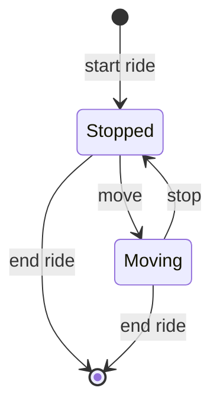

<div align="center">

# 🚕 Digital Taximeter

**A software taximeter that prices a ride in real time, second by second, depending on whether the vehicle is stopped or moving.**


[📖 Overview](#-overview) • [🚀 Getting started](#-getting-started) • [🧪 Tests](#-running-the-tests) • [🔌 API](#-api) • [🧱 Architecture](#-architecture) • [🧭 Key decisions](#-key-decisions)

</div>

## 📖 Overview

TaxiTech Solutions' physical Hale T200 taximeters are out of vendor support (since 2023) and failing, with no repair path. Before committing budget to an external vendor, management needs a working prototype of a fully software-based replacement.

This project is that prototype: a **REST API** (FastAPI) and a **web panel** (React) that let a driver start a ride, switch between _stopped_ and _moving_, and get the exact fare when the ride ends.

| State                        | Rate               |
| ---------------------------- | ------------------ |
| 🔴 Stopped, or under 20 km/h | **€0.02** / second |
| 🟢 Moving                    | **€0.05** / second |

_Rates follow the EMT Madrid zone (June 2025) and are editable at runtime._

**👥 Who is it for?**

- 🧑‍✈️ **Drivers** start rides, toggle the vehicle state and see the live amount.
- 📊 **Fleet managers** review the daily ride history to reconcile takings.
- 🛠️ **The tech team** adjusts rates without redeploying.

**✨ Features**

- ⏱️ Live amount and elapsed time while a ride is running
- 🗓️ Ride history by date
- 💶 Default rates and per-ride rates, changeable from the panel
- 🔒 Password-protected access (single company account, registered on first visit)
- 📘 Interactive API docs (Swagger UI), generated automatically

## 🚀 Getting started

**Prerequisites:** Python 3.13+, Node.js 20+.

Start the API:

```bash
cd back
python -m venv .venv && source .venv/bin/activate
pip install -r requirements.txt
uvicorn taximetro.api:app --reload
```

Start the web panel, in a second terminal:

```bash
cd front
npm install
npm run dev
```

Then open http://localhost:5173. On the first visit you register a company name and a password; after that you just log in.

| URL                        | What                                                   |
| -------------------------- | ------------------------------------------------------ |
| http://localhost:5173      | Web panel (Vite dev server, proxies `/api` to the API) |
| http://localhost:8000/docs | Swagger UI                                             |

> [!TIP]
> To run everything as one process, build the panel with `npm run build` in `front/`. FastAPI then serves `front/dist` at http://localhost:8000/.

> [!NOTE]
> One-command Docker deployment (`docker-compose up`) is planned but not implemented yet (TICKET-014).

## 🧪 Running the tests

```bash
# Backend: unittest (stdlib), 90 tests
cd back && source .venv/bin/activate
python -m unittest discover -s tests

# Frontend: Vitest + Testing Library, 43 tests
cd front && npm test
```

The project was built test-first (red, green, refactor).

## ⏱️ How a ride works



`amount = sum(seconds in each state × rate of that state)`. Money is never rounded mid-calculation, only at the API boundary (2 decimals). When a ride ends it is saved to history with its final amount.

## 🔌 API

Every endpoint except `/api/auth/*` requires `Authorization: Bearer <token>`. Full interactive contract in Swagger UI at `/docs` once the API is running.

| Method      | Endpoint                              | Purpose                                |
| ----------- | ------------------------------------- | -------------------------------------- |
| `GET`       | `/api/auth/status`                    | Is an account registered?              |
| `POST`      | `/api/auth/setup` · `/api/auth/login` | First-run registration, login          |
| `POST`      | `/api/ride/start`                     | Start a ride (optional per-ride rates) |
| `PATCH`     | `/api/ride/state`                     | Switch `stopped` / `moving`            |
| `GET`       | `/api/ride`                           | Current ride with live amount          |
| `POST`      | `/api/ride/end`                       | End the ride and return the total      |
| `GET` `PUT` | `/api/rates`                          | Read / update default rates            |
| `GET`       | `/api/rides?date=YYYY-MM-DD`          | Ride history for a day                 |
| `GET`       | `/api/rides/{id}`                     | One past ride                          |

## 🧱 Architecture

The backend is a layered (hexagonal) architecture. Dependencies only point inward: `api → application → domain ← infrastructure`.

```
project_py_taximetro/
│
├── back/                          # Python API (FastAPI)
│   ├── taximetro/
│   │   ├── domain/                # Business rules: pure Python, no I/O
│   │   │   ├── ride.py                 → Ride: accumulates time per state, computes the amount
│   │   │   ├── ride_state.py           → RideState enum (stopped / moving)
│   │   │   ├── ride_record.py          → Immutable record of a finished ride
│   │   │   ├── rates.py                → Rates value object (validated, frozen)
│   │   │   ├── account.py              → Account value object (company + password hash)
│   │   │   ├── errors.py               → Domain exceptions
│   │   │   ├── ride_repository.py      → Port (ABC): ride storage
│   │   │   ├── rates_repository.py     → Port (ABC): rates storage
│   │   │   └── account_repository.py   → Port (ABC): account storage
│   │   │
│   │   ├── application/           # Use cases, depend only on domain + ports
│   │   │   ├── ride_service.py         → Start / change state / end ride, history
│   │   │   ├── auth_service.py         → Register, login, token check
│   │   │   └── token_store.py          → In-memory session tokens
│   │   │
│   │   ├── infrastructure/        # Adapters implementing the ports
│   │   │   ├── sqlite_ride_repository.py    → Rides in SQLite
│   │   │   ├── ini_rates_repository.py      → Rates in config.ini
│   │   │   ├── ini_account_repository.py    → Account in auth.ini
│   │   │   ├── pbkdf2_password_hasher.py    → Salted PBKDF2-HMAC-SHA256 hashing
│   │   │   └── logging_setup.py             → File logging for the API
│   │   │
│   │   ├── api/                   # FastAPI presentation layer
│   │   │   ├── factory.py              → App factory (mounts routes and the built front)
│   │   │   ├── dependencies.py         → Dependency injection + auth guard
│   │   │   ├── schemas.py              → Pydantic request / response models
│   │   │   └── routes/
│   │   │       ├── auth.py             → /api/auth/*
│   │   │       ├── ride.py             → /api/ride/*
│   │   │       ├── rates.py            → /api/rates
│   │   │       └── history.py          → /api/rides
│   │   │
│   │   ├── settings.py            # Paths (config.ini, auth.ini, taximetro.db, front/dist)
│   │   └── bootstrap.py           # Composition root: the only place choosing concrete classes
│   │
│   ├── tests/                     # unittest, one file per module
│   │   ├── fakes.py                    → In-memory ports (fast, isolated tests)
│   │   ├── test_ride.py  test_rates.py  test_ride_service.py  test_auth_service.py
│   │   ├── test_api.py  test_api_auth.py
│   │   ├── test_sqlite_ride_repository.py  test_ini_rates_repository.py
│   │   ├── test_ini_account_repository.py  test_pbkdf2_password_hasher.py
│   │   └── test_token_store.py  test_logging_setup.py
│   │
│   ├── config.ini                 # Default rates (tracked)
│   ├── schema.sql                 # Reference copy of the rides table
│   └── requirements.txt
│
├── front/                         # React + Vite + MUI web panel
│   ├── index.html
│   ├── vite.config.js             # Dev server, proxies /api to localhost:8000
│   ├── package.json
│   └── src/
│       ├── main.jsx  App.jsx           → Entry point + providers
│       ├── routes/
│       │   └── AppRoutes.jsx           → Routes + auth gate
│       ├── pages/                      # One per screen
│       │   ├── WelcomePage.jsx         → Register / login
│       │   ├── RidePage.jsx            → Active ride
│       │   └── HistoryPage.jsx         → Ride history
│       ├── components/                 # Presentational only
│       │   ├── auth/                   → AuthForm
│       │   ├── layout/                 → AppShell, Header, NavTabs, Footer, LogoutButton
│       │   ├── ride/                   → ActiveRidePanel, NoRidePanel, RideControls,
│       │   │                             RideMeter, StartRideDialog, StateBadge
│       │   ├── history/                → RideHistory, RideTable, RideDetailDialog
│       │   └── common/                 → ConfirmDialog, PageLoader, SectionTitle
│       ├── hooks/                      # State, polling and actions
│       │   ├── useActiveRide.js  useTodayRides.js  useDefaultRates.js
│       │   └── useAuth.js  useAuthFlow.js
│       ├── context/
│       │   └── AuthContext.jsx         → Session owner (token, 401 logout)
│       ├── services/                   # The ONLY code that calls the API
│       │   ├── apiClient.js            → Axios instance + interceptors
│       │   ├── authService.js  rideService.js  ratesService.js
│       │   └── tokenStorage.js
│       ├── theme/                      → tokens.js → styles.js → theme.js (MUI theme)
│       ├── utils/                      → format.js, rideState.js (pure helpers)
│       └── tests/                      # Mirrors src/ (Vitest + Testing Library)
│           ├── setup.js
│           ├── App.integration.test.jsx    → Full user flows
│           └── components/  context/  hooks/  services/  utils/
│
├── .gitignore
└── README.md
```

> [!NOTE]
> Runtime files are git-ignored and created locally: `back/auth.ini` (credentials), `back/taximetro.db` (SQLite), `back/taximetro.log`, `back/.venv/`, `front/node_modules/` and `front/dist/`.

In the frontend, components only render, hooks own state and logic, and `services/` is the only code that talks to the API.

## 🧭 Key decisions

| Decision                                    | Why                                                                                |
| ------------------------------------------- | ---------------------------------------------------------------------------------- |
| Hexagonal layers, ports and adapters        | Pricing rules stay pure and testable; swapping the database means one new adapter. |
| Standard library first                      | Fewer dependencies: `sqlite3`, `configparser`, `hashlib`, `unittest`.              |
| `unittest` over `pytest`                    | Zero dependencies, JUnit-like style.                                               |
| FastAPI over Flask                          | Swagger/OpenAPI docs for free at `/docs`.                                          |
| SQLite                                      | No server to run; data survives restarts.                                          |
| Vite proxy instead of CORS                  | The panel is the only API consumer; in production both share one origin.           |
| FastAPI serves the React build              | One process, one deploy unit, no nginx.                                            |
| Frozen dataclasses for value objects        | `Rates`, `RideRecord`, `Account` validate themselves on creation.                  |
| Salted PBKDF2-HMAC-SHA256 (600k iterations) | Password never stored in plain text; hash lives in a git-ignored `auth.ini`.       |
| In-memory fakes in tests                    | Fast, isolated tests; the slow hasher is faked too.                                |

> [!WARNING]
> This is a prototype with deliberate limits: session tokens live in memory (lost on restart), there is a single account, one active ride per process, and no locking.

## 🧰 Tech stack

|          |                                                             |
| -------- | ----------------------------------------------------------- |
| Backend  | Python, FastAPI, Uvicorn, Pydantic, SQLite                  |
| Frontend | React, Vite, MUI, Axios, React Router                       |
| Tests    | unittest + FastAPI `TestClient`, Vitest + Testing Library   |
| Config   | `config.ini` (rates), `auth.ini` (credentials, git-ignored) |

> [!NOTE]
> The client is Spanish, so the web panel copy is in Spanish. Code and comments are in English.

## 👩‍💻 Author

Built by **Marie Charlotte Doulcet** as a solo project for the Factoria F5 P1 IA School training, Barcelona.

[](https://www.linkedin.com/in/marie-charlottedoulcet/)
